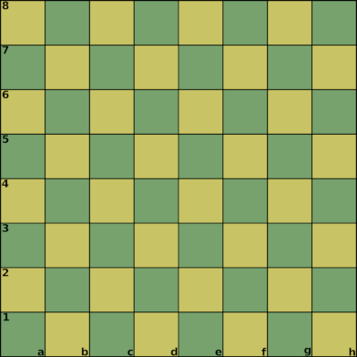
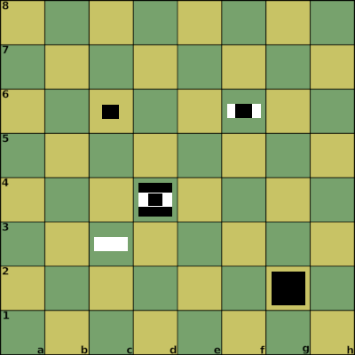

# Nerva

by Afrasinei Alexandru Iulian

## Introduction

Nerva is a board game that utilizes a standard chess board and 192 pawns + 2 kings.

Two oposing forces (White and Black) face each other in battle on the game board.

It is a turn based wargame in the spirit of chess with different rules,

the goal is to capture the enemy king.

## The elements of Nerva

* one chess board (8x8)

* White

    * Pieces shapes

        Pawns (Box, HalfBox, SmallBox) ,  King (Cylinder)

        
    
    * 96 pieces (pawns)
        * 32 boxes
        * 32 half boxes
        * 32 small boxes

    * the king (cylinder)

* Black

    * Pieces shapes

        Pawns (Box, HalfBox, SmallBox) ,  King (Cylinder)

        

    * 96 pieces (pawns)
        * 32 boxes
        * 32 half boxes
        * 32 small boxes

    * the king (cylinder)

## The board

A standard chess boad (8x8).

### The battle environment

Maximum three pawns can be placed on top of each other anywhere on the table.

Think at the board as 3 stacked boards on top of each other.

### Game notation

The chess algebraic notation is used to identify table locations.

https://en.wikipedia.org/wiki/Algebraic_notation_(chess)

This is extended for Nerva by using the following syntax to identify tables:

[column][row]_[table] - A pawn is placed on the table

[K]_[column][row]_[table] - King reveal

[-K]_[column][row]_[table] - King is dead, game over

Examples:

* a1_1

* d4_2

* a1_3

* K_a1_3 - This is a king reveal

* -K_a2_2 - The king is dead, game over

* a1_1 d4_2 a1_3 K_A1_3

## The pieces

### The pawns

On a board tile, stack the pieces in this order: Box, HalfBox and SmallBox

Thinking in terms of stacked boards:

board 1 use the normal boxes, for board 2 use the half boxes and board 3 the small boxes.

Examples:

* c3_2 (White Pawn on board 2)

* g2_1 (Black Pawn on board 1)

* d4_1 d4_2 d4_3 (Black Pawn board 1, White Pawn board 2, Black Pawn board 3)

* c6_3 (Black Pawn on board 3)

* f6_2 f6_3 (White Pawn on board 2, Black Pawn on board 3)

#### White

96 pawns and white king

#### Black

96 pawns and the black king

#### Properties

Each pawn has 1 attack point and 1 defense point.

The pawn is at c3 the adjacent tiles will be:

b2 c2 d2 d3 d4 b4 c4 b3

The attack and defense will happen on this adjacent tiles.

More details on this in the rules of defense and attacking sections. 

### The king

The king has no attack points.

## The rules of placement

### Setup

The game starts with an empty table.

Each player gets their 96 pawns and their king.

White player place the first pawn on the board. 

The pawns can be placed on any empty tile or on top of existing pawns.

Maximum of 3 pawns can be stacked on a tile.

### King location

King location is hidden to the enemy player.

Each player decide at the begining where his king will be located, and keep the information to himself.

For example it can be written on a piece of paper.

Another option is to have a friend, spectator decide the positions of both kings.

The king will be placed on the board when it is revealed , when a player place a pawn on its position.

When the king is revealed its the duty of the player or spectator to place it on the board.

### Game started

The starting player can place a pawn and the players keep taking turns to place pawns.

Game is over when all pawns are placed or one of the kings is dead.

## The rules of defense

A pawn will add a defense point to all adjacent friendly pawns (or king).

Example:

The pawn is at c3 the adjacent tiles will be:

b2 c2 d2 d3 d4 b4 c4 b3

Any friendly pawn on this positions will receive an aditional defense point from c3 pawn.

## The rules of attacking

A pawn will add an attack point to all adjacent enemy pawns (or king).

Adjacent enemy pawns can be attacked. 

If the attack points are higher then the defense points on a particular pawn the attack will be succesfull.

The pawn will be removed from the board and replaced by another pawn from the attacker.

Each attack takes a turn.

If you make a mistake and make an unsuccessful attack the turn will change.

## The rules of stacking

When 3 pawns from the same player has the same position on all 3 boards (a stack of 3 pawns)

then each recieve a 3 defense points and 3 attack points.

When a stack like this is formed the existing pawn points will be replaced to 3.

There is no addition of existing points, so be carefull with this.

Example:

c3_1 c3_2 c3_3

## Goal 

The goal is to reveal and capture the enemy king.

## Credits, contact

Afrasinei Alexandru Iulian

Email:

alexandruafrasinei@gmail.com

Github website:

https://github.com/aiafrasinei/Nerva
