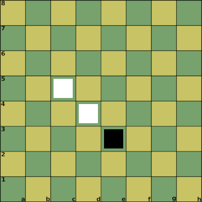

# Attack 1

Notation:

1. d4_1 2. e3_1 3. c5_1

Properties:

| Position | Attack Points | Defense Points |
| :--- | :--- | :--- |
| d4_1 | 2 | 1 |
| e3_1 | 1 | 1 |
| c5_1 | 2 | 1 |

Result:

* d4_1 -> e3_1 : successful attack (2 vs 1)
