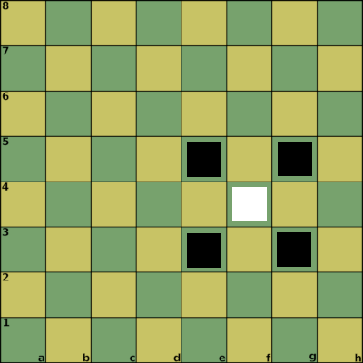

# offense on one board (depth 1)

Notation:

1. f4_1 2. e3_1 3. e5_1 4. g5_1 5. g3_1

Properties:

| Position | Attack Points | Defense Points |
| :--- | :--- | :--- |
| f4_1 | 1 | 1 |
| e3_1 | 1 | 1 |
| e5_1 | 1 | 1 |
| g5_1 | 1 | 1 |
| g3_1 | 1 | 1 |

Result:

e5_1 -> f4_1 : successful attack (4 vs 1)