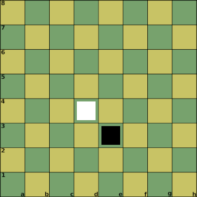
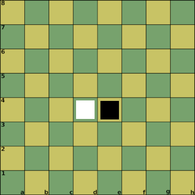
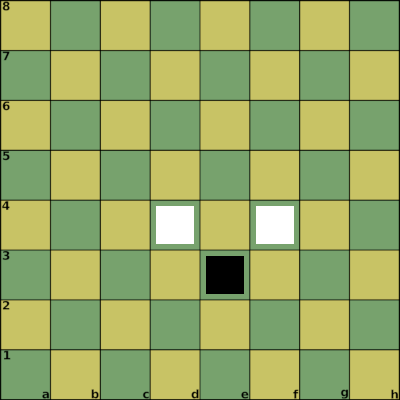
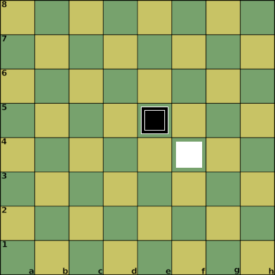
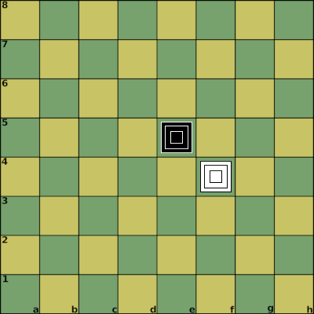
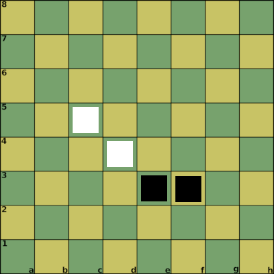
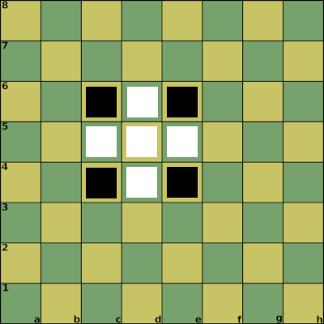

# tests

The tests contains various intreasting board configuration.

Format is board configuration , properties, result.

Goal is to find potential problems with the rules and understand the game better.

Can be used by the players to learn the game.

Examples:

## Attack

Notation:

1. d4_1 2. e3_1

Properties:

| Position | Attack Points | Defense Points |
| :--- | :--- | :--- |
| d4_1 | 1 | 1 |
| e3_1 | 1 | 1 |

Result:

* d4_1 -> e3_1 : failed attack (1 vs 1)

Notation:

1. d4_1 2. e4_1

Properties:

| Position | Attack Points | Defense Points |
| :--- | :--- | :--- |
| d4_1 | 1 | 1 |
| e4_1 | 1 | 1 |

Result:

* d4_1 -> e4_1 : failed attack (1 vs 1)

Notation:

1. d4_1 2. e3_1 3. c5_1

Properties:

| Position | Attack Points | Defense Points |
| :--- | :--- | :--- |
| d4_1 | 2 | 1 |
| e3_1 | 1 | 1 |
| c5_1 | 2 | 1 |

Result:

* d4_1 -> e3_1 : successful attack (2 vs 1)

Notation:

1. d4_1 2. e3_1 3. f4_1

Properties:

| Position | Attack Points | Defense Points |
| :--- | :--- | :--- |
| d4_1 | 1 | 1 |
| e3_1 | 1 | 1 |
| f4_1 | 1 | 1 |

Result:

* d4_1 -> e3_1 : successful attack (2 vs 1)

Notation:

1. e5_1 2. f4_1 3. e5_2

Properties:

| Position | Attack Points | Defense Points |
| :--- | :--- | :--- |
| e5_1 | 2 | 2 |
| f4_1 | 1 | 1 |
| e5_2 | 2 | 2 |

Result:

* e5_1 -> f4_1 : successful attack (2 vs 1)

Notation:

1. f4_1 2. e5_1 3. f4_2 4. e5_2 5. f4_3 6. e5_3

Properties:

| Position | Attack Points | Defense Points |
| :--- | :--- | :--- |
| f4_1 | 3 | 3 |
| f4_2 | 3 | 3 |
| f4_3 | 3 | 3 |
| e5_1 | 3 | 3 |
| e5_2 | 3 | 3 |
| e5_3 | 3 | 3 |

Result:

* e5_1 -> f4_1 : failed attack (3 vs 3)

Notation:

1. f4_1 2. e3_1 3. e5_1 4. g5_1 5. g3_1

Properties:

| Position | Attack Points | Defense Points |
| :--- | :--- | :--- |
| f4_1 | 1 | 1 |
| e3_1 | 1 | 1 |
| e5_1 | 1 | 1 |
| g5_1 | 1 | 1 |
| g3_1 | 1 | 1 |

Result:

e5_1 -> f4_1 : successful attack (4 vs 1)

## Defense

Notation:

1. d4_1 2. e3_1 3. c5_1 4. f3_1

Properties:

| Position | Attack Points | Defense Points |
| :--- | :--- | :--- |
| d4_1 | 2 | 1 |
| e3_1 | 1 | 2 |
| c5_1 | 2 | 1 |
| f3_1 | 1 | 2 |

Result:

* d4_1 -> e3_1 : failed attack (2 vs 2)

Notation:

1. d5_1 2. e6_1 3. d6_1 4. c6_1 5. c5_1 6. c4_1 7. d4_1 8. e4_1 9. e5_1

Properties:

| Position | Attack Points | Defense Points |
| :--- | :--- | :--- |
| d5_1 | 1 | 5 |
| e6_1 | 1 | 1 |
| d6_1 | 3 | 2 |
| c6_1 | 1 | 1 |
| c5_1 | 3 | 2 |
| c4_1 | 1 | 1 |
| d4_1 | 3 | 2 |
| e4_1 | 1 | 1 |
| e5_1 | 3 | 2 |

Result:

Max defense for a pawn on a single board using depth 1.

