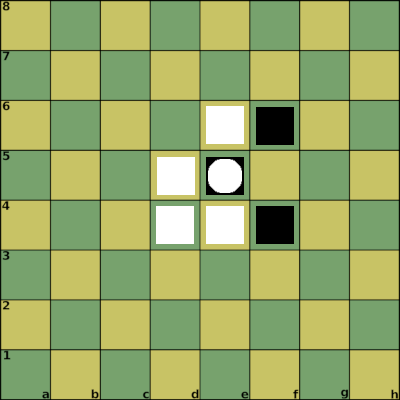

# King capture 1

Notation:

1. d4_1 2. e5_1 3. e4_1 4. f4_1 5. e6_1 6. f6_1 7. K_e5_2

Properties:

| Position | Attack Points | Defense Points |
| :---  | :--- | :--- |
| d4_1  | 1 | 3 |
| e5_1  | 3 | 1 |
| e4_1  | 2 | 2 |
| f4_1  | 2 | 1 |
| e6_1  | 2 | 1 |
| f6_1  | 2 | 1 |
| K_e5_2 | 0 | 0 |

Result:

* d4_1 -> e3_1 : failed attack (2 vs 2)
